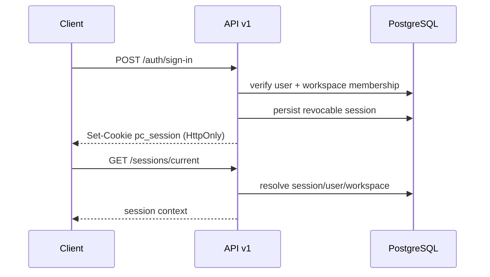
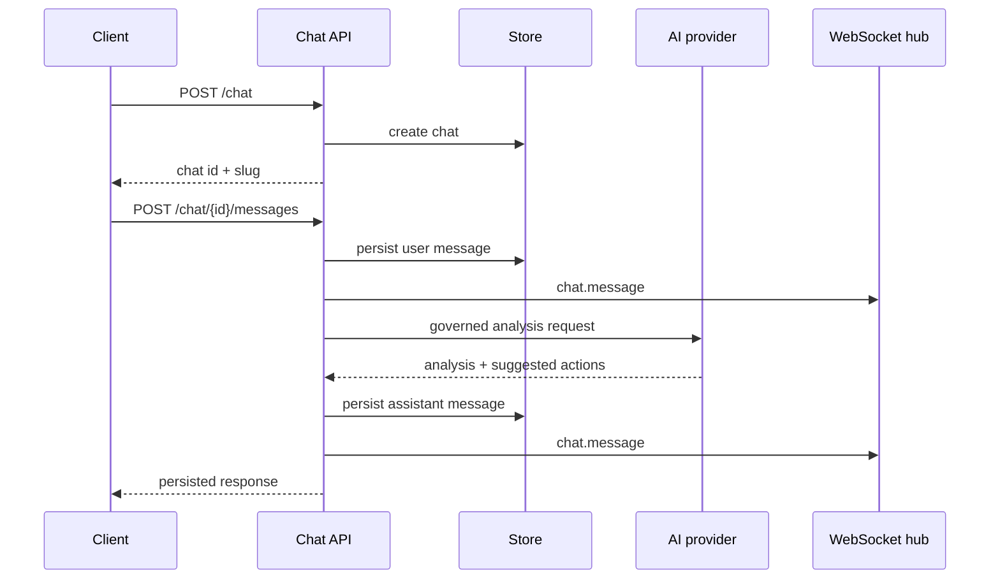
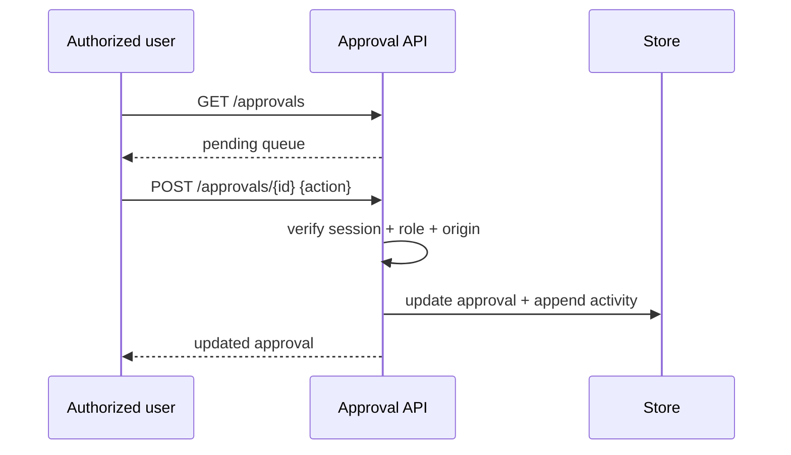

# API flows

## Authentication and session

`rememberMe=true` creates a persistent session cookie; ordinary sessions remain non-persistent. Sign-out/revocation invalidates the persisted session, not only the browser cookie.

## Persisted Copilot chat

Suggested actions are UI navigation/action proposals. They are not proof that an approval or execution occurred.

## Governed approval

Only `owner`, `admin`, and `operator` roles may mutate approval state in v1.

## WebSocket fallback

1. Client fetches the chat over HTTP.
2. Client opens `/ws/v1/chat/{id}` with the same authenticated browser session.
3. On disconnect/error, client stops treating realtime as current.
4. Client polls/refetches the HTTP chat endpoint.
5. Client reconciles persisted message IDs; it does not synthesize missing events.

## Market and network adapters

Market and Solana endpoints call server-side providers. Missing keys, provider failures, stale responses, or RPC errors are surfaced as failures/degraded status. No client should convert provider failure into fabricated price or network truth.
